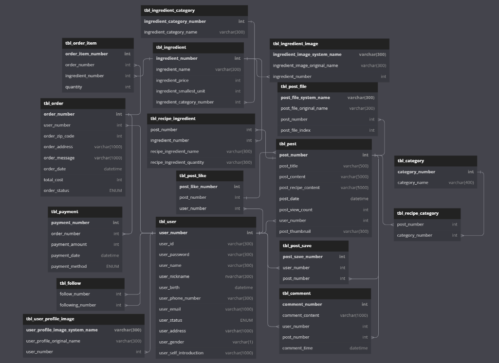

# 팀명 : yumyumgood
# 프로젝트 이름 : cookpang

## 🛠 Stacks

## 🧑‍🤝‍🧑 맴버구성

|팀장|이동재|           
|:--:|:--:|
|부팀장|김대연|
|팀원|강승연|
|팀원|박은서|
|팀원|송지호|

## 🕰️ 개발 기간
* 23.05.24일 - 23.07.21일

## 🖥️ 프로젝트 소개 

1. sns컨셉으로 사용자가 자신의 레시피를 공유하고 다른사람들의 레시피도 찾아 볼 수 있는 사이트
2. 레시피에 필요한 재료들을 구매 할 수 있는 사이트

## ERD구성

## 📌 주요 기능
#### 관리자 - <a href="https://github.com/DongJae92/mealme/wiki" >상세보기 - WIKI 이동</a>
- 관리자 메인 : 고객 관리(일반 회원, 기업 회원), 오늘의 할 일, 일별 매출 현황, 최근 7일, 30일 평균 및 합계
- 회원 정보 : 기업 회원, 일반 회원 조회 및 관리
- 상품 주문 : 주문 목록 조회, 수정 및 관리
- 상품 등록/수정 : 상품명, 정보, 분류, 가격 등록 및 수정
- 상품 목록 : 상품 목록 조회 및 수정 페이지로 이동
